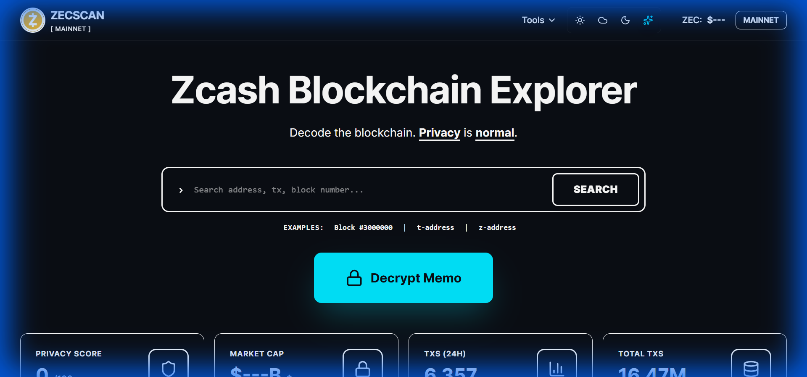
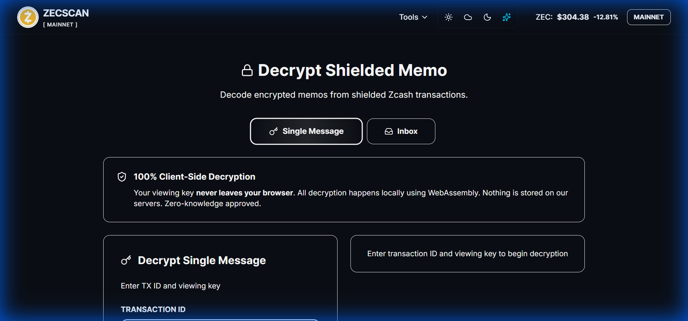
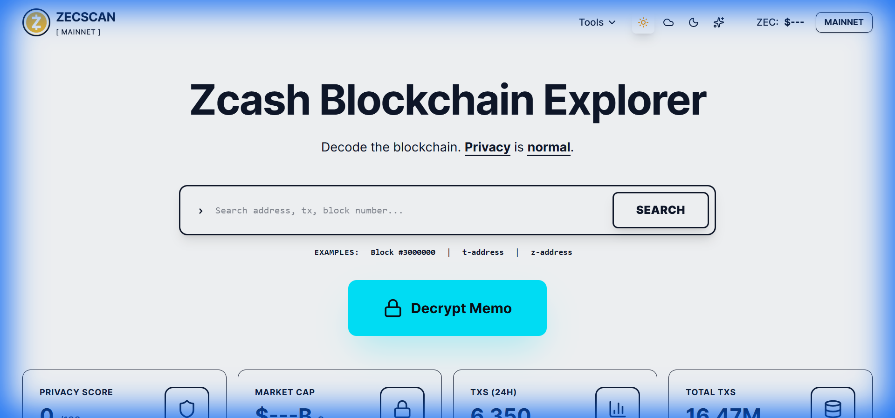

# ZecScan - Zcash Blockchain Explorer




A modern, privacy-focused blockchain explorer for the Zcash network. ZecScan makes exploring the Zcash blockchain intuitive and beautiful, with powerful features for viewing transactions, blocks, addresses, and decrypting shielded memos.

**Live Demo:** [zecscan.vercel.app](https://zecscan.vercel.app/)

## Why ZecScan?

Zcash is unique in the blockchain space for its privacy features, but understanding shielded transactions can be challenging. ZecScan bridges this gap by providing an accessible interface that respects your privacy while giving you the tools to explore the blockchain.

Whether you're tracking a transaction, exploring block data, or decrypting memos from your shielded wallet, ZecScan has you covered.

## Key Features

### Comprehensive Search
Search the Zcash blockchain by transaction ID, block hash, block height, or address. Get instant results with detailed breakdowns of:
- Transaction amounts and fees
- Shielded and transparent pools
- Block confirmations
- Memo field data

### Client-Side Memo Decryption
Decrypt shielded transaction memos without compromising your privacy:
- **100% client-side processing** - Your viewing key never leaves your browser
- **WebAssembly powered** - Fast, secure decryption using Zcash cryptography
- **Single message mode** - Decrypt individual transactions
- **Inbox scanner** - View all your shielded transactions at once
- **Zero server storage** - Nothing is logged or stored on our servers



### Multiple Themes
Choose from four beautiful themes to match your preference:
- **Dark** - Perfect for late-night blockchain exploring
- **Light** - Clean and crisp for daytime viewing
- **Dim** - Easy on the eyes with twilight colors
- **Midnight** - Deep blues and purples for the night owls



### Real-Time Data
- Live blockchain statistics
- Latest blocks and transactions
- Mempool viewer for pending transactions
- Network stats and metrics

### API Access
Full REST API access for developers:
- Transaction lookups
- Block information
- Address balances
- Mempool data

## Technology Stack

ZecScan is built with modern web technologies for performance and reliability:

- **Frontend Framework:** Next.js 14 with React 18
- **Styling:** Tailwind CSS with custom theme system
- **Language:** TypeScript for type safety
- **Deployment:** Vercel for edge computing
- **Data Source:** Blockchair API and Nighthawk integration
- **Cryptography:** WebAssembly for Zcash decryption

## Getting Started

### Prerequisites

Before you begin, make sure you have the following installed:
- **Node.js** (v18 or higher)
- **npm** or **yarn** package manager
- **Git** for cloning the repository

### Installation

1. Clone the repository:
```bash
git clone https://github.com/Dairus01/Zecscan.git
```

2. Navigate to the project directory:
```bash
cd Zecscan/web
```

3. Install dependencies:

Using npm:
```bash
npm install
```

Using yarn:
```bash
yarn install
```

4. Set up environment variables (if needed):
```bash
cp .env.example .env.local
```

### Running Locally

Start the development server:

Using npm:
```bash
npm run dev
```

Using yarn:
```bash
yarn dev
```

The application will be available at `http://localhost:3000`

### Building for Production

To create a production build:

Using npm:
```bash
npm run build
npm start
```

Using yarn:
```bash
yarn build
yarn start
```

## Usage

### Searching the Blockchain

1. Navigate to the homepage
2. Enter a transaction ID, block hash, block height, or address in the search bar
3. Press enter or click the search icon
4. View detailed information about your query

### Decrypting Memos

#### Single Message Decryption

1. Go to the **Decrypt** page
2. Click on the **Single Message** tab
3. Enter your transaction ID (64-character hex string)
4. Enter your Unified Full Viewing Key (starts with `uview1`)
5. Click **Decrypt Memo**
6. Watch the terminal animation and view your decrypted transaction details

#### Inbox Scanner

1. Go to the **Decrypt** page
2. Click on the **Inbox** tab
3. Paste your Unified Full Viewing Key
4. Select your scan period from the dropdown
5. Click **Scan My Transactions**
6. Browse your shielded transactions and click **View More** on any transaction to see full details

### Exploring Blocks and Transactions

- **Recent Blocks:** The homepage displays the latest blocks on the Zcash blockchain
- **Recent Transactions:** View the most recent transactions across the network
- **Network Stats:** Check current network health, price, and statistics
- **Mempool Viewer:** See pending transactions waiting for confirmation

### Using the API

Access blockchain data programmatically through our API endpoints:

```bash
# Get transaction details
curl https://zecscan.vercel.app/api/transaction/[txid]

# Get block information
curl https://zecscan.vercel.app/api/block/[height]

# Get address balance
curl https://zecscan.vercel.app/api/address/[address]
```

Full API documentation is available at `/api-docs`

## Project Structure

```
Zecscan/
├── web/
│   ├── src/
│   │   ├── app/              # Next.js app directory
│   │   │   ├── decrypt/      # Memo decryption pages
│   │   │   ├── api/          # API routes
│   │   │   └── ...           # Other pages
│   │   ├── components/       # Reusable components
│   │   ├── lib/              # Utility functions and API clients
│   │   └── styles/           # Global styles
│   ├── public/               # Static assets
│   └── package.json          # Dependencies
└── docs/                     # Documentation and images
```

## Privacy & Security

Your privacy matters. Here's how ZecScan protects you:

- **Client-side decryption only** - Viewing keys are processed in your browser using WebAssembly
- **No server logs** - Transaction IDs are sent via POST requests to avoid URL logging
- **Zero data storage** - We don't store any of your sensitive information
- **Open source** - Review the code yourself to verify our privacy claims
- **No analytics tracking** - Your browsing is your business

## Contributing

We welcome contributions from the community! Here's how you can help:

1. **Fork the repository**
2. **Create a feature branch:** `git checkout -b feature/amazing-feature`
3. **Commit your changes:** `git commit -m 'Add amazing feature'`
4. **Push to the branch:** `git push origin feature/amazing-feature`
5. **Open a Pull Request**

### Code Style

- Follow TypeScript best practices
- Use Tailwind CSS for styling
- Write meaningful commit messages
- Add comments for complex logic
- Test your changes thoroughly

### Reporting Issues

Found a bug or have a feature request? Please open an issue on GitHub with:
- A clear description of the problem
- Steps to reproduce (for bugs)
- Expected vs. actual behavior
- Screenshots if applicable

## Roadmap

Here's what's coming next to ZecScan:

- [ ] Mobile app (iOS and Android)
- [ ] Advanced transaction graph visualization  
- [ ] Historical price charts and analytics
- [ ] Multi-language support
- [ ] Wallet integration for direct memo decryption
- [ ] Enhanced mempool analytics
- [ ] Block explorer statistics dashboard

## Acknowledgments

ZecScan is built with love for the Zcash community. Special thanks to:

- **Blockchair** - For providing reliable blockchain data
- **Nighthawk** - For decryption technology integration
- **Electric Coin Company** - For developing Zcash
- **Zcash Community** - For continuous support and feedback

## Support

- **Website:** [zecscan.vercel.app](https://zecscan.vercel.app/)
- **X (Twitter):** [@DairusOkoh](https://x.com/DairusOkoh)
- **GitHub:** [Dairus01/Zecscan](https://github.com/Dairus01/Zecscan)

If you find ZecScan useful, consider supporting development!

## License

This project is licensed under the MIT License - see the [LICENSE](LICENSE) file for details.

---

**Built with love for the Zcash community**

*Privacy is Normal*
